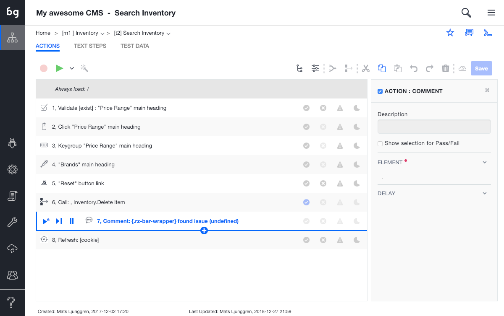

Adding comments
============

Why comment?
------------
In a lot of cases there are errors that can only be spotted by human, such as look & feel bugs or poor choice of language. In this case it´s very useful to be able to point this out and have a simple way for a team member on the receiving side being able to correct this. For these cases we use the Comment action. 

The Comment action
------------------
The comment actions adds a comment, or annotation, to the application. In order to add a Comment, simply click on the Plus icon and select Add Comment, and select the element in the application page to Comment. You can write directly into the Comment dialog on the application.

Running a test with comments
----------------------------
When running a test with comments, the test will execute and stop at the first comment. In order to go to the next comment, simply press play again and the test will continue executing until it finishes or hits the next comment. This is very useful when fixing look & feel issues, as several issues can be recorded in the same test case. 