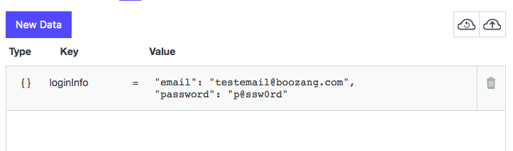
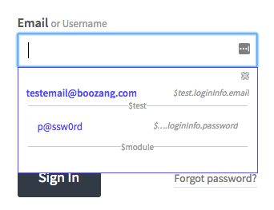

Data binding
============

Introduction
------------
Boozang introduces very simple way to bind data directly in the recording of forms. This is really useful becuase it allows you to create a test case very quickly, and after it has been created to feed it with different sets of data without any re-recording. 

Data binding from forms
-----------------------
Start recording as you would usually do. As soon as you enter into a form where you want to bind data, simple click the checkbox "Bind Data". As soon as you enter data into any input field it will suggest to bind the data into $project.fieldname, $module.fieldname, or $test.fieldname, where fieldname is our suggestion of the variable name based on the field properties. Simple click on the data to create a data bind. For instance, if you choose to bind to $test.data.email you will see $test.data.email to have been created under the data tab and {{$test.data.email}} being used in the recorded action. 

Binding data at different levels
--------------------------------
If you already have test data specified when started, you can start by entering this into the data tab at either project, module or test level. The rule of thumb should be to keep data on the project level for data that can be re-used across modules, such as login information. Module data should be reserved for module-specific data. For instance, in an Inventory module the inventory test data should be kept. Test data is reserved for data that is only used for a particular test case, and for temporary data.   

Property data
-------------
The simplest way to bind data into forms is to create a property. Simply specify a property name and a value. This is good for singular variables but often it's preferred to use a JSON object. 

JSON object data 
----------------
The most common way to bind data into forms is by creating an object. This allows you to group similar data together - for instance login information. In the example above we have created an object loginInfo (camel-case is good practice for data names) with the properties username and password.

Binding data into forms
-----------------------
After specifying the data on either project, module or test level, simply start recording a test in the usual fashion. When encountering a form where the data should be input, simply click the checkbox "Bind data" in the toolbar, and select the field. You will be able to select from all your data. Note that if the field name matches the data name it will show on top. 

Auto-form fill
--------------
As we are already guessing which data belongs in what field, you can allow Boozang to attempt to fill the whole form. Simply click auto-fill and watch the form being filled. This is completely dependant on you using data field names that are consistent with what your application field names are. 