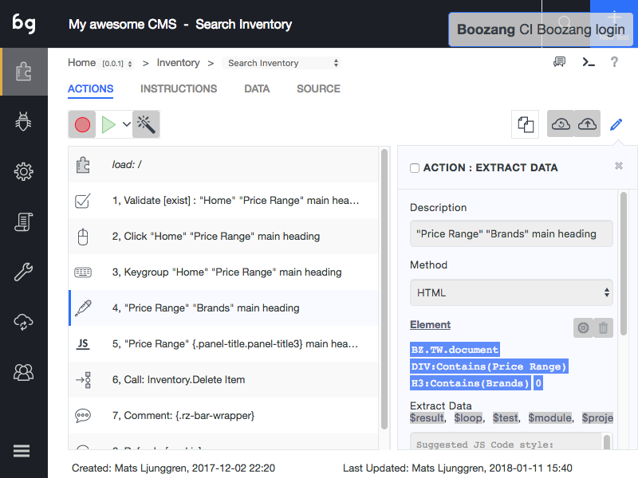

Extracting data
============

Note: For API versions of these actions check the API section. 

Similarities with Validation
---------------
With Boozang it´s possible to extract data from the application window. This is very similar to the Validation action, with the difference that the element extracted is copied into a data variable. Make sure to familiarize yourself with the Validation action before reading this section. 

Introducing data
----------------
Start by defining a data variable in the data tab. For extraction you typically want to use a property. The property can be defined on project, module and test level. Add it on test level if the data will only be used in the test case. Add it on module level if the data will be used across different tests in the module, but not on different modules. Add it on project level if it will be used globally. 

Extracting data action
----------------------
To add an extract data action, simply click on the Plus icon and select Extract data, then click on an element in the application window you want to extract. 
