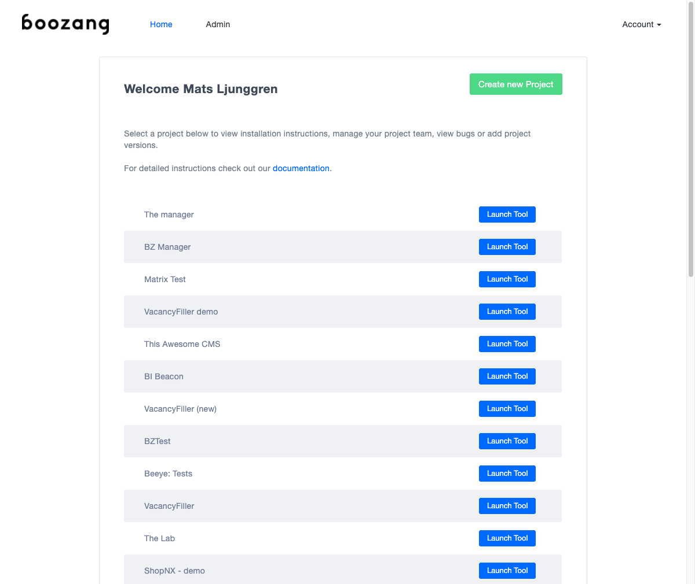

Validation
============




Creating a simple validation
----------------------------
In a test it´s common to make sure that a certain outcome is acheieved. In Boozang we do this using validations, also known as assertions. To create a validation, simply click on the validation icon and select the element to validate in the application window. The default validation content format: "validate exists" will be created. If you want to change validation content format to "innerText", "data", or "screenshot" you can do this in the tool window. 

Validate Exists
---------------
The default validation is "Validate Exists", that will simple verify that the element exists. To edit the validation conten format simply change it from the action detail page. The expectation value will be automatically updated. 


Inner Text
----------
If you want to validate the content of an element, change the Content format dropdown to innerText. This way the text content of an element is compared. When changing this, the result box will be populated with the content from your application, but can be changed manually. This is very useful for string comparisons. One advantage of using Inner Text is that upon validation failure, the report will contain the difference between expected and real result. 

Data
----
The data format is very powerful, but TODO

Screenshot
----------
You can also choose to take a picture of the element and compare that to the image of an element of future runs. This is useful TODO

The DOM picker
--------------
Sometimes the element you selected in the page isn't the one you intended. In this case, simply click the DOM picker and re-select the element. The DOM picker dialog will popup where you can select exactly what to validate in the DOM tree. Use the checkboxes to select which elements to include in the matching. Make sure that the checkbox has a green highlight, which means the element is uniquely matched (not indexed).

Javascript validations
----------------------
The default validation is the HTML validation. By changing method to "Script" you can directly do validations using Javascript. The Javascript function written in the standard Boozang format

```
(function(){
	//return true/false;
	})()
```
and must return true or false. If an element has been picked with the DOM picker this will be available using the handle $element. Standard data handles, such as $project, $module, and $test will also be available, as well as the test window handle $TW. For more information about data see <a href="/doc/data.html">data</a> section. 

API validations
---------------
See section for API validations <a href="/doc/api-validation.html">here</a>.